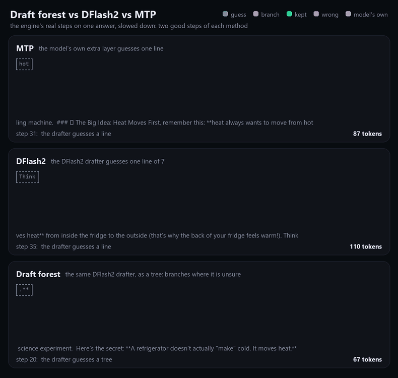
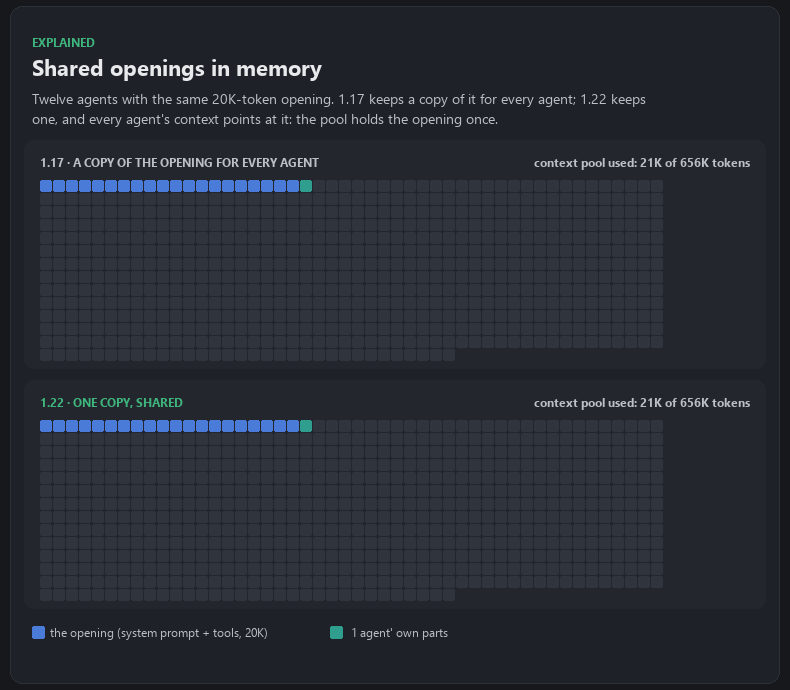
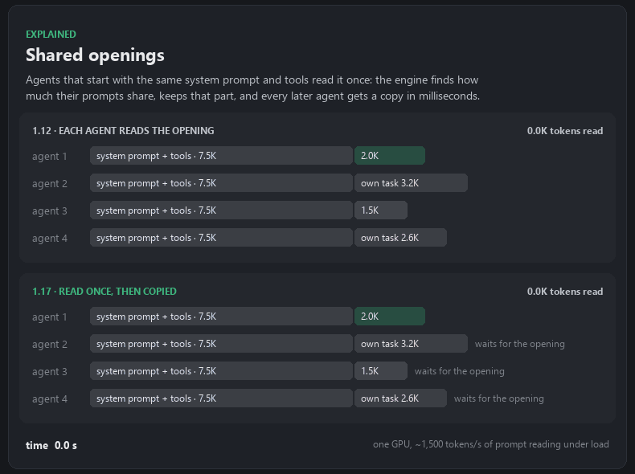

# Changelog

What changed in each release of MegaCapybara. Downloads are on the [releases page](https://github.com/perkel666/MegaCapybara/releases).

## 1.35 (2026-10-07)

- **Draft forest.** When you pick DFlash2, the engine now takes the drafter's guesses as a tree: where it is unsure it
  also tries its second and third choices, so a miss on one branch is often caught by another. With several agents,
  all their trees share one check and the rows go where guesses are likeliest to be kept. Against 1.17: 12 agents
  about 26% faster on code and 20% on prose; one agent about 5% faster on code and 10% on prose.

  

- **More tokens per second in total with many agents:** cheaper shared steps, and no ~25 ms stall per new request.
- **Shared openings use their memory once:** agents with the same opening share one copy of it in the context pool
  (12 agents, a 20K-token opening: 88% less pool), and it moves to the RAM cache as one copy.

  

- **The model files were re-measured** with this version (many agents on a server already running) and their scores
  updated on Hugging Face: the launcher's projections for DFlash2 are the draft forest's. Coding with 8 agents against
  1.17: Tiny 1,890 -> 2,333, Small 1,755 -> 2,379, Medium 1,638 -> 2,203, Large 1,427 -> 1,953, XXL 1,255 -> 1,645
  tokens/s; one agent as before. (Replaces v1.34, released earlier the same day with figures measured on a freshly
  started server.)
- **Crash and hang reports** in the log (functions and lines; `megacapybara.pdb` ships beside the server) and a dump in
  `logs\`.
- **Fixed:** a crash when a shared opening was kept with the RAM cache nearly full; the monitor freezing under heavy
  load; agents re-reading their whole conversation after part of its cache went to RAM; a cached conversation read
  again when VRAM was briefly short; all running conversations ending at once when a moved conversation came back with
  the RAM cache full; the monitor listing idle conversations as held in VRAM.

## 1.17 (2026-10-05)

- **Shared openings are read once.** Agents that start with the same system prompt and tools read that part once;
  later ones copy it in milliseconds. Prompts sent together (a dispatch of agents, or the conversations coming back
  after a restart) wait for the first one instead of each reading it. The engine finds the shared length by itself.

  

- The log says when a conversation cannot be resumed and why, and when a shared opening is kept or reused.
- **Fixed: agents re-reading their whole conversation every turn (1.12).** Under heavy agent load, 1.12's RAM cache
  could fill Windows' memory limit for the GPU, and conversations lost their resume point (on a busy session 110 turns
  in 27 minutes re-read 4.8M tokens). 1.17 counts the memory the cache really holds and keeps room for every running
  conversation's resume point.

## 1.12 (2026-10-05)

- **Faster prompt reading.** About 8-9% faster: 8 prompts of ~11K tokens at once 7.4K -> 8.1K tokens/s, a
  145K-token prompt 5.2K -> 5.6K tokens/s (small model, RTX 5090).
- **Faster generation in long conversations.** Each speculative round is 4-9% faster from 8K to 240K tokens of
  context (up to 20% with long drafts); short conversations are unchanged.
- **Agents keep their cache while they wait.** A conversation counts as finished only after 20 minutes without a turn,
  and one whose last tool call runs in the background (`run_in_background`) stays open.
- The shared context is about 3% smaller (larger buffers for reading prompts).

## 1.08 (2026-10-04)

- **See where each conversation's context is.** The monitor's Conversations tab shows VRAM, RAM and disk side by
  side, each conversation as a dot with its size; a prompt being read shows in its slot.
- **Statistics tab** (instead of the launcher's Server log): how the slots spent the last 10 minutes and the time
  since the server started, so you can see whether the clients send enough work or requests wait for context.
- **Smarter cache, the disk as the last resort.** Finished jobs' caches go first and are never written to disk;
  nothing idle for an hour stays on disk; an active conversation's state stays in RAM. On a busy hosted hour this
  removes thousands of disk round trips and the ~3 s wait they added to agent turns.
- The server's log tags every conversation (`[conv N]`), so its turns and its cache can be followed.

## 1.04 (2026-10-03)

- **Download counts on Hugging Face.** After the launcher downloads a model, it requests that model repository's
  `config.json` once, so Hugging Face counts the download. Nothing about you or your PC is sent.

## 1.03 (2026-10-03)

Conversations keep their cache when many agents share the server. Under memory pressure, 1.02 could drop a whole idle
conversation (often 100K–300K tokens) and read it again from scratch on its next turn.

- A conversation coming back from RAM no longer causes another one to be dropped: it swaps places with an idle one.
- Running out of pinned RAM moves another conversation to disk instead of dropping the one being moved.
- The conversations needed last make room first; one is never pushed out for one that is needed later.

## 1.02 (2026-10-03)

- First public release: the server and the launcher for Windows 11 and Linux, the presets, and model downloads from
  Hugging Face in the launcher.
