

  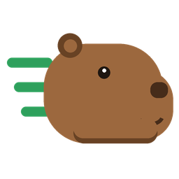

<h1 align="center">MegaCapybara</h1>

  <b>The fastest inference engine for Qwen3.8-27B on the NVIDIA GeForce RTX 5090.</b> 
  Over 500 tokens/s for one coding agent and up to 2,800 tokens/s for a team of twelve, on Windows 11 and Linux. 
  A launcher sets it up and shows, before you load, what every setting costs in accuracy, speed and memory.

  <a href="../../releases/latest"><b>Download for Windows</b></a> &nbsp;·&nbsp;
  <a href="../../releases/latest"><b>Download for Linux</b></a> &nbsp;·&nbsp;
  <a href="https://huggingface.co/perkel/Qwen3.8-27B-MC">Models on Hugging Face</a> &nbsp;·&nbsp;
  <a href="docs/USAGE.md">Usage guide</a>

  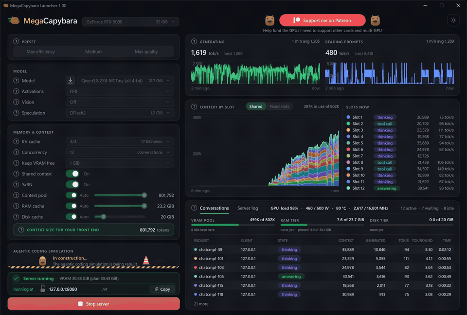
   
  <i>Twelve coding agents working at once on one RTX 5090 with the Tiny model, at about 1,500 tokens/s.</i>

## Features

### Fast: built for the RTX 5090

State-of-the-art inference for Qwen3.8-27B on the RTX 5090, for one agent and for many at once:

- **Kernels tuned to this card.** The weights are stored in MXFP4 and MXFP6, 4- and 6-bit formats that the RTX 5090's
  tensor cores compute natively. Each step takes barely longer than reading the weights from memory once, which is
  the card's hard limit.
- **Speculative decoding.** A small DFlash2 drafter guesses the next few tokens and the model checks them all in one
  step: the same answers, 3-4 times faster on code.
- **Confidence scheduling, from DSpark.** Every round, each conversation drafts only as many tokens as are likely to
  be accepted.

| Tokens per second | Tiny | Small | Medium | Large | XXL |
|---|--:|--:|--:|--:|--:|
| One agent coding | 540 | 495 | 440 | 377 | 313 |
| 8 agents coding, in total | 1,890 | 1,754 | 1,638 | 1,427 | 1,254 |

Greedy decoding with thinking off, on an RTX 5090 with its memory overclocked by 20%. A stock card is somewhat
slower.

  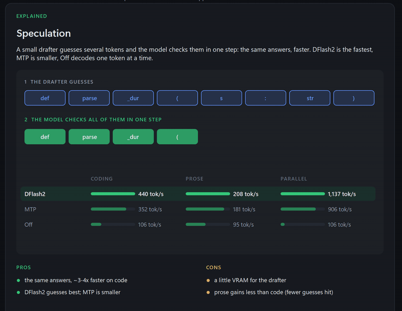

### Built for a team of agents

Agents never work in step: one reads a 100K-token codebase while another writes a two-line fix. So instead of a fixed
slice each, MegaCapybara gives them **one shared pool of context**:

- any agent can use the model's full context when its task needs it;
- no memory sits reserved for agents that are idle;
- long tasks are never cut short or compacted early.

Fixed slots are one switch away if you prefer them.

  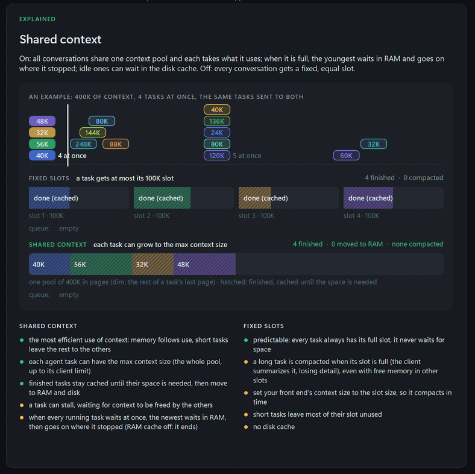

Before every GPU step, the scheduler decides what runs:

- **Continuous batching.** All agents that are writing get their next tokens in the same step, up to 12 at once. A
  new request joins at the next step, and its prompt is read a piece at a time between the steps, so even a
  100K-token prompt never freezes the agents that are writing.
- **Batched speculative decoding.** Each conversation drafts its own tokens, and one pass checks the drafts of all of
  them together.
- **Paged memory.** The pool is split into pages of 512 tokens. A conversation takes pages as it grows and gives them
  back when it is done.
- **First come, first served.** The request at the front of the queue starts as soon as there is room for its prompt,
  so small requests can never keep a big one waiting forever.
- **Prefix reuse.** A returning agent goes back to where its conversation is cached, and only the new part of its
  prompt is read.
- **Queue-aware eviction.** When memory runs short, idle conversations move from VRAM to RAM, then to disk. The ones
  no waiting request needs go first, then the ones the queue needs last: the idea behind Belady's optimal policy. In
  our multi-agent test this served 20% more prompt tokens than plain LRU eviction.
- **Preemption by swapping.** If every agent that is writing needs more room at the same moment, the youngest one
  moves to RAM whole. It comes back before any new request starts and continues exactly where it stopped: nothing is
  lost and nothing is computed twice.

### Pick up where you left off

When an agent sends its next request, its conversation is usually still cached: in VRAM, in RAM (back in about 3 ms)
or on disk (back in seconds). The reply starts right away instead of reading a long prompt again from the start.

  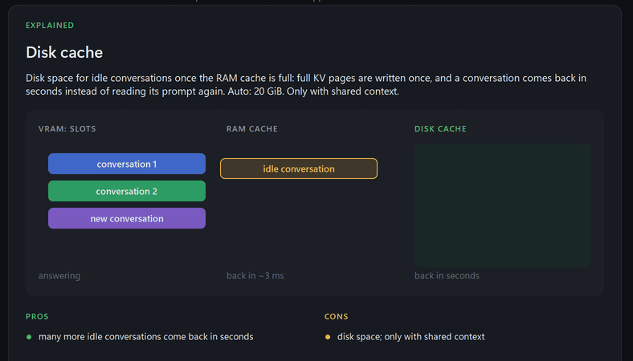

### See what each setting costs before you load

Every model file carries its own accuracy scores, measured against Qwen's original weights, and every setting has a
measured cost. The launcher adds them up for exactly the settings you pick:

- how close the answers stay to the original;
- how fast it runs;
- how much VRAM, RAM and disk it needs.

Switch to a smaller model or a 4-bit KV cache and you see right away what you trade for the extra speed or context.

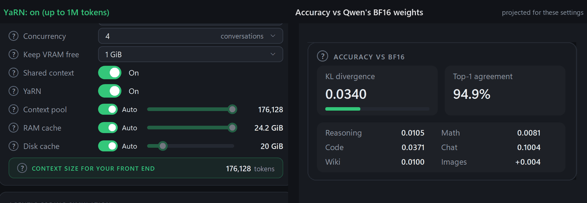

### How close to the original

**Top-1 agreement** is how often the model picks the same next token as Qwen's original weights: higher is closer.
Unsloth's GGUF quants are widely considered the state of the art for running models locally, so here is how our model
files compare with them, size for size.

Unsloth's stay a little closer at the same size. Ours use the 4- and 6-bit formats that the RTX 5090 computes
natively, which is where MegaCapybara's speed comes from.

<picture>
  <source media="(prefers-color-scheme: dark)" srcset="docs/images/top1-by-size-dark.png">
  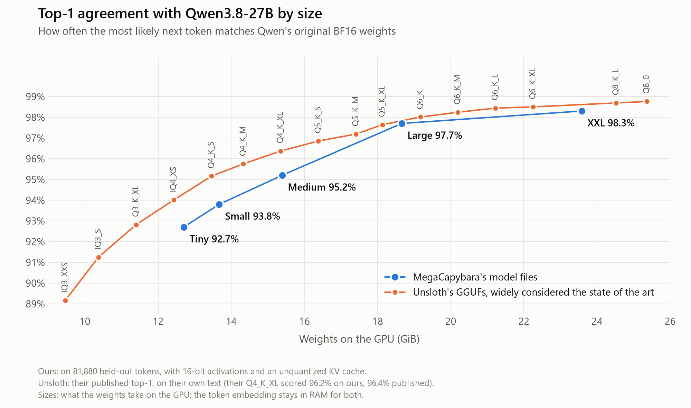
</picture>

### Every setting explained

Hover any `?` in the launcher for a plain explanation of its setting: an animated picture, the options compared on
your PC, and their pros and cons. The animations on this page are taken from those panels.

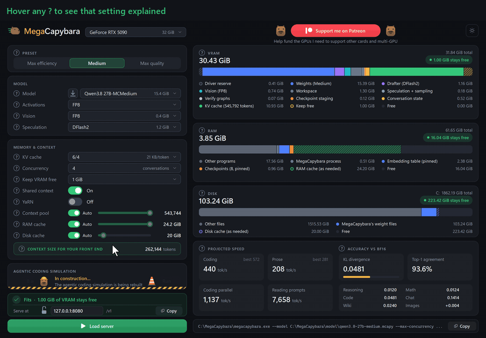

### Models in one click

Press the arrow next to the model to list every model file on Hugging Face, then download one with a click:

- 8 connections at once;
- resumes after an interruption;
- checked against its SHA-256 hash;
- no account needed.

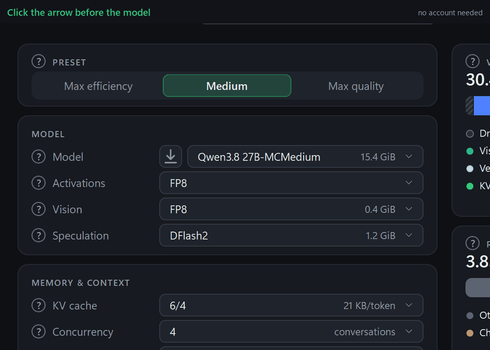

### Works with your tools

MegaCapybara speaks both OpenAI's and Anthropic's APIs, including tool calls, thinking and images. Point your client
at it:

| Client | Base URL |
|---|---|
| OpenCode, Cline, Continue, Open WebUI and other OpenAI-compatible clients | `http://127.0.0.1:8080/v1` |
| Claude Code and Anthropic's SDKs | `http://127.0.0.1:8080` |

- **On your network:** set a password first, with the lock next to the address in the launcher.
- **On Linux:** the same launcher runs on X11, Wayland and WSL2, or the server runs alone over SSH.

Setup for each client: [docs/USAGE.md](docs/USAGE.md).

### Prefer the terminal?

The launcher is optional. The `presets` folder has ready-made start scripts, `.bat` on Windows and `.sh` on Linux:
the launcher's three presets and six more, one for each model size and number of agents. Run one and the server
starts with a live dashboard showing the speed, prompt reading, each agent's context, and what every conversation is
doing.

- **Edit a preset:** each script explains every setting right above it. Change the values, or copy the file to make
  your own.
- **Or copy from the launcher:** set everything up there and press **Copy** at its bottom right. You get the full
  command line for those settings, ready for a terminal or a script.

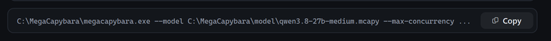

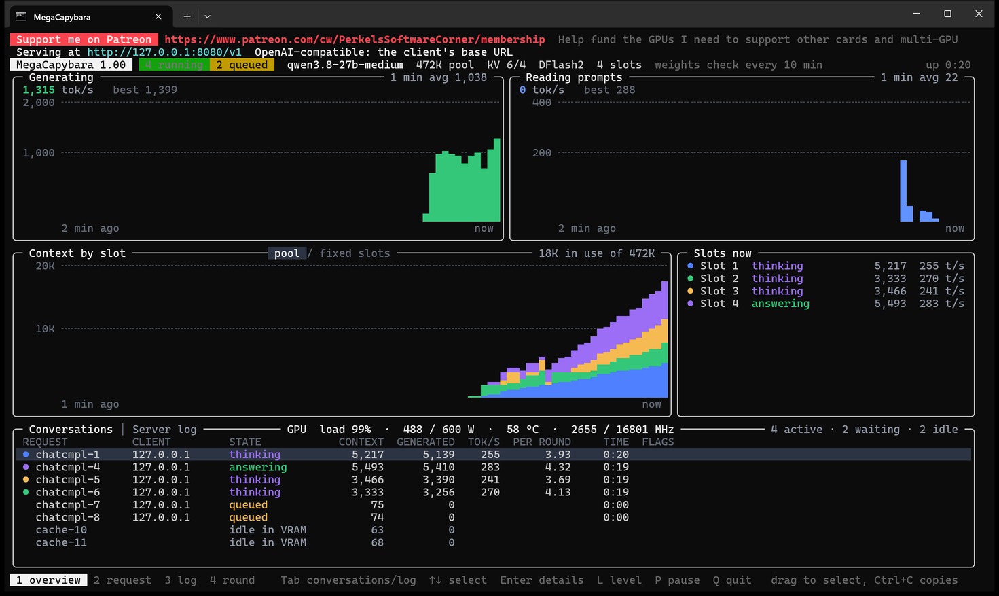

Every option is in [docs/USAGE.md](docs/USAGE.md) and in `megacapybara --help`.

## Get started

1. Download the archive for your system from [Releases](../../releases/latest) and unpack it anywhere.
2. Run **`MegaCapybaraLauncher`**. Windows may warn you once because the programs are not code-signed: click
   **More info**, then **Run anyway**.
3. Press the arrow next to the model and download one. **Medium** is a good start.
4. Pick a preset and press **Load server**.
5. Point your client at **`http://127.0.0.1:8080/v1`** and set its context size to the number under
   **Context size for your front end**.

## Requirements

- An **NVIDIA GeForce RTX 5090** with driver **R580** or newer.
- **Windows 11** x64, or **Linux** x86-64 with glibc 2.38 or newer (Ubuntu 24.04, Debian 13, Fedora 39 or newer; WSL2
  works too).
- **32 GB of RAM** or more, and **15-30 GB of disk** per model.

Nothing else to install: the programs are self-contained and the folder can live anywhere you can write to. On
Linux, the launcher uses the desktop's own X11, Cairo, Pango and libcurl, and offers to install any that are missing.

## Models

Converted from [Qwen/Qwen3.8-27B](https://huggingface.co/Qwen/Qwen3.8-27B), in five sizes:
[perkel/Qwen3.8-27B-MC](https://huggingface.co/perkel/Qwen3.8-27B-MC).

| Size | VRAM | KL divergence | Top-1 agreement | Coding, 1 agent | 8 agents | 12 agents | Good for |
|---|--:|--:|--:|--:|--:|--:|---|
| Tiny | 12.70 GiB | 0.0582 | 92.7% | 537 tok/s | 2,333 tok/s | 2,782 tok/s | the most speed and context |
| Small | 13.67 GiB | 0.0478 | 93.8% | 499 tok/s | 2,379 tok/s | 2,584 tok/s | speed, with a little more accuracy |
| Medium | 15.39 GiB | 0.0298 | 95.2% | 436 tok/s | 2,203 tok/s | 2,529 tok/s | the balance, and the presets' choice |
| Large | 18.66 GiB | 0.0081 | 97.7% | 372 tok/s | 1,953 tok/s | 2,269 tok/s | answers close to the original |
| XXL | 23.58 GiB | 0.0051 | 98.3% | 307 tok/s | 1,645 tok/s | 1,921 tok/s | the closest to the original, less room for context |

Accuracy measured against Qwen's original BF16 weights on 81,880 held-out tokens. KL divergence: 0 is identical,
lower is closer. Top-1 agreement: how often the most likely next token is the same. Speeds measured on one RTX 5090
with MegaCapybara 1.34 (DFlash2 with the draft forest, FP8 activations): coding answers up to 2,000 tokens, one agent
alone, and eight or twelve at once (all of them writing, on a server already running); the launcher shows them for your
own settings.

The same five sizes also come uncensored, converted from an abliterated release (one with the refusals removed):
[perkel/Qwen3.8-27B-Uncensored-MC](https://huggingface.co/perkel/Qwen3.8-27B-Uncensored-MC).

## License

MegaCapybara is released as programs for Windows and Linux for now; the source code will be published later.

MegaCapybara is under the [MIT License](LICENSE), (c) 2026 Perkel's Software Corner. The model weights and the
libraries it includes keep their own licenses: see [THIRD-PARTY-NOTICES.md](THIRD-PARTY-NOTICES.md). Each release
lists its changes in its notes and in the package's `CHANGELOG.txt`.

## Support

If MegaCapybara is useful to you, you can support it on
[Patreon](https://www.patreon.com/cw/PerkelsSoftwareCorner/membership). The money goes to the GPUs needed to support
more cards and multi-GPU.
